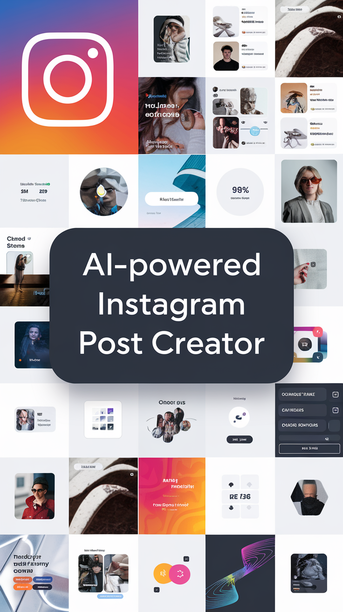

# AI Crew for Instagram Post

## Descriptions
- This GitHub repository, "AI-Crew-for-Instagram-Post", is a project that aims to provide an AI-powered solution for creating Instagram posts.

## Libraries Used
- langchain
- langchain_groq
- langchain_community
- python-dotenv
- requests
- unstructured
- crewai
- crewai[tools]

## File and Folder Explanation
1. `lib`: contains configuration and utility code files.
2. `setup`: contains core building blocks for our crew.
3. `main.py`: main function that will run our crew.
4. `lib/conifg.py`: contains functions to load our environment variables and get our api keys.
5. `lib/utils.py`: contains a function to initialize our llm.
6. `setup/agents.py`: contains a class for setting up different agents with specific skills and a particular job to do. 
7. `setup/tasks.py`: contains a class for setting up different tasks which are specific assignments completed by agents. 
8. `setup/tools`: contains a folder for setting up a tool which is a skill or function that agents can utilize to perform various actions. 

## Installation
 1. Prerequisites
    - Git
    - Command line familiarity
 2. Clone the Repository: `git clone https://github.com/NebeyouMusie/AI-Crew-for-Instagram-Post.git`
 3. Create and Activate Virtual Environment (Recommended)
    - `python -m venv venv`
    - `source venv/bin/activate` for Mac and `venv/bin/activate` for Windows
 4. Navigate to the projects directory `cd ./AI-Crew-for-Instagram-Post` using your terminal
 5. Install Libraries: `pip install -r requirements.txt`
 6. Enter your `GROQ_API_KEY`, `SERPER_API_KEY` and `BROWSERLESS_API_KEY` in the `example.env` file then change the file to `.env`. You can get your `GROQ_API_KEY` from [here](https://console.groq.com/keys), your `SERPER_API_KEY` from [here](https://serper.dev/api-key) and your `BROWSERLESS_API_KEY` from [here](https://account.browserless.io/)
 7. run `python main.py`

## Star it
- Give the repo a star if you like it ⭐

## Acknowledgments
 - I would like to thank [Crew AI](https://docs.crewai.com/)
   
## Contact
 - LinkedIn: [Nebeyou Musie](https://www.linkedin.com/in/nebeyou-musie)
 - Gmail: nebeyoumusie@gmail.com
 - Telegram: [Nebeyou Musie](https://t.me/NebeyouMusie)
 - Telegram Channel: [Neba's AI Lab](https://t.me/Neba_s_AI_Lab)
